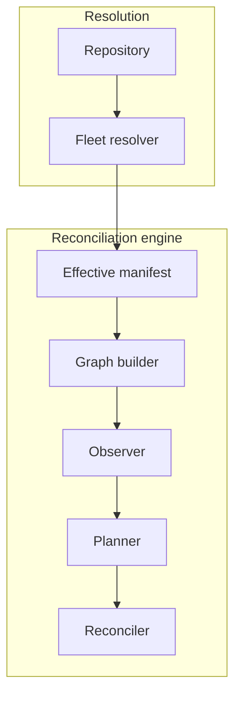

# Deployment

The agent clones or fetches the repository, resolves its own manifest, and reconciles.

```text
Git
 ↓
Datum agent
```

!!! note "Implementation status"

    Nothing here exists yet. The arrangement is what the first implementation targets, and the
    boundary it describes is the part that matters.

## The manifest is the seam

Everything after composition consumes the effective manifest and nothing else from the
repository. The graph builder, observer, planner and reconciler never read a `Layer`,
evaluate a matcher, or examine the revision beyond recording it.



That boundary bounds what the rest of the system has to understand. A bug in ordering or
verification can be reproduced from a manifest without a repository.

Keeping the seam there has a cost, which is that the manifest has to be a real
serialisable artefact with a canonical form rather than an internal data structure. That
cost is being paid deliberately.

## How it works

The agent clones or fetches the repository, resolves its own manifest, and reconciles.

There is no server, no database and nothing that has to reach the host. A machine behind
NAT with outbound access to a Git remote is fully manageable, and Datum being unavailable
somewhere central cannot stop a host from reconciling.

Reconciliation itself needs no inbound access. The optional [metrics
endpoint](../observability/metrics.md#exposure) is the one thing that listens, it binds to
loopback by default, and a host that never exposes it reconciles exactly the same way.

What it costs is that every managed host needs read access to the whole
repository. Resolution requires every `Layer` and every `Host` document, so a
host cannot be given only its own configuration, and any secret in the
repository is readable by every machine under management. A single compromised
host exposes the fleet's configuration, not just its own.

Fleet-wide status is also awkward. Each host holds its own result and nothing
aggregates them, so answering which hosts are converged means collecting from
each one.

Resolution on the host is sufficient for the installations this targets, and the manifest boundary
is what keeps the engine independent of where resolution happened.
