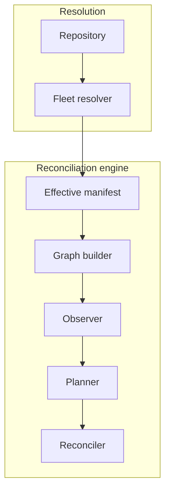

# Deployment

The agent clones or fetches the repository, resolves its own manifest, and reconciles.

```text
Git
 ↓
Datum agent
```

There is no server, no database and nothing that has to reach the host in order for it to
reconcile. A machine behind NAT with outbound access to a Git remote is fully manageable,
and no central outage can stop a host from reconciling.

The agent opens one optional listener, the [metrics
endpoint](../observability/metrics.md#binding-and-exposure), bound to loopback by default and
disableable. Nothing arriving there changes what the host applies, so a host that never
exposes it reconciles exactly the same way.

## What this costs

Every managed host needs read access to the whole repository. Resolution requires every `Layer` and
every `Host` document, so a host cannot be given only its own configuration, and anything committed
to the repository is readable by every machine under management. A single compromised host exposes
the fleet's configuration, not just its own. Secrets are referenced rather than committed for that
reason.

Host identity is not a security control. A machine that claims to be a different host gains nothing
it could not already read, which is why identity is [about classification, not
access](host-identity.md).

Fleet-wide status is awkward. Each host holds its own result and nothing aggregates them, so
answering which hosts are converged means collecting from each one.

## The manifest is the seam

Everything after composition consumes the effective manifest and nothing else from the
repository. The graph builder, observer, planner and reconciler never read a `Layer`,
evaluate a matcher, or examine the revision beyond recording it.



Keeping resolution and reconciliation on opposite sides of a serialisable artefact is
[ADR-0007](../adr/0007-effective-manifest-as-input.md). It costs the manifest a canonical
form it would not otherwise need, and it buys an engine that can be tested against a manifest
with no repository and no host in the picture.
