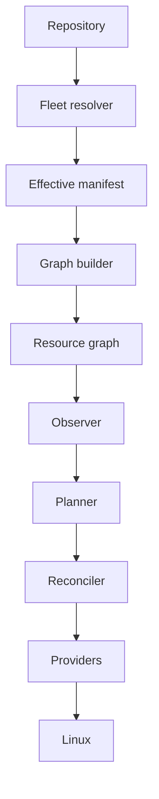
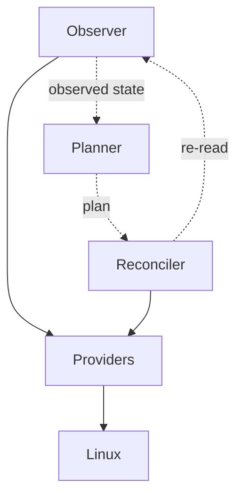

# Architecture

Datum is arranged as a pipeline, where each stage takes a defined input, produces a defined output
and passes it to the next stage. Every intermediate artefact can be rendered, compared between runs
and inspected.

The stages alternate between components, which do work, and artefacts, which
hold state. The fleet resolver produces an effective manifest, the graph builder
produces a resource graph, the observer produces observed state, and the planner
produces a plan. The artefacts are named separately because each one can be
rendered on request, and because the interface between stages is the artefact
rather than the component.

## Components and phases

The five reconciliation phases do not map one to one onto components.

| Component | Phases it performs |
| --------- | ------------------ |
| Fleet resolver | Resolving desired state, which precedes all five |
| Graph builder | Validation, which also precedes all five |
| Observer | Observe |
| Planner | Diff and plan |
| Reconciler | Apply and verify |

Diffing and planning sit in one component because ordering actions requires the
graph the planner already holds. Applying and verifying sit together so that a
change is only reported as done once it has been read back.

## Where providers sit in the pipeline

Providers appear at the end of the diagram above, but they are called by the
observer to read state and by the reconciler to change it, so the same provider
code serves two stages.

A provider therefore implements both reading and writing for the resource types
it supports. Verification uses the same read path as the initial observation, so
a provider cannot report success through a channel observation does not cover.

## Boundaries the architecture is built around

The provider boundary is the one that keeps distribution differences contained.
Everything above it deals in resource types and fields, and everything below it
deals in package managers, init systems and filesystem calls. No component above
the boundary reads `/etc/os-release` or branches on a distribution.

The observation boundary separates reading from writing. The observer and the
read paths of providers make no change to the host, which is what allows a plan
to be inspected before it is applied.

The identity boundary separates what a host may assert about itself from what
the repository determines about it. A host proves which machine it is and the
repository holds what that machine is for, so a compromised machine cannot
reclassify itself into a more privileged part of the fleet.

## What runs where

All of this runs on the host being reconciled. There is no component that has to
reach out to a machine, and reconciliation works on a host with no inbound network
access. The [metrics endpoint](../observability/metrics.md#exposure) listens where it
is configured to, and it takes no part in reconciliation.

A larger installation may eventually resolve manifests centrally and deliver them
to agents, which changes where the fleet resolver runs without changing anything
after it. The reconciliation engine takes an effective manifest as input and does
not care whether that manifest arrived from a local checkout or over a network.

## The pages

[Components](components.md)
:   What each component is responsible for, and what it does not do.

[Reconciliation flow](reconciliation-flow.md)
:   The data moving between components during one pass, and where a failure stops it.

[Dependency graph](dependency-graph.md)
:   How ordering is derived, why document position has no effect on it, and how failure
    propagates along edges.

[Host identity](host-identity.md)
:   The boundary between what a host asserts about itself and what the repository
    decides about it.

[Deployment](deployment-models.md)
:   How the agent gets the repository, what that arrangement costs, and where resolution
    stops and reconciliation begins.

[Managing Datum with Datum](self-management.md)
:   The boundary between the agent as a reconciler and the agent as a resource it manages,
    and why the running reconciler does not replace its own binary.
