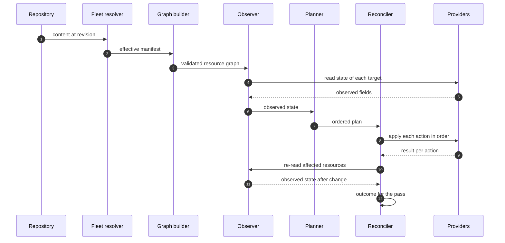

# Reconciliation flow

This page follows the data through one pass, naming what moves between each pair
of components and what happens when a stage fails. The sequence is the same
whether the pass ends in an empty plan or applies fifty changes.



## Stage by stage

**Repository to fleet resolver.** The pass fixes a revision before doing
anything else, so that every artefact it produces refers to the same content. A
revision that cannot be resolved ends the pass before a manifest exists, which
is reported as a failure to obtain desired state, not as a reconciliation
failure.

**Fleet resolver to graph builder.** The manifest crossing this boundary is
complete and already merged, carrying provenance for each resource. Conflicts
between layers of equal precedence have already stopped the pass by this point,
since resolution fails where a manifest cannot be resolved deterministically.

**Graph builder to observer.** What crosses is a validated graph. Unresolvable
`requires` references, cycles and duplicate target identities are all rejected
here, and none of them have caused the host to be read.

**Observer to providers and back.** Each resource's target is read through the
provider for its type. This is where the host is first touched, and every access
is a read.

**Observer to planner.** Observed state crosses as a set of field values per
resource, including fields marked unobservable. The planner receives no partial
picture, so a resource the observer could not read at all is represented
explicitly rather than being absent from the set.

**Planner to reconciler.** The plan is the last artefact produced before anything
changes, and a pass asked only to report stops here. What continues is a total
order of actions, each naming its resource, its provider and the fields involved.

**Reconciler to providers.** Actions are handed over one at a time in plan order.
A provider receives one resource and one operation and has no view of the rest of
the pass.

**Reconciler to observer.** Verification reuses the observer instead of trusting
what providers reported, which is what makes the check independent of the code
that made the change.

## Where failure stops the pass

Failures fall into two groups, and the difference is whether the host has been
touched.

| Stage | Effect of failure |
| ----- | ----------------- |
| Obtaining a revision | Pass ends. Host untouched. |
| Resolving the manifest | Pass ends. Host untouched. |
| Building the graph | Pass ends. Host untouched. |
| Observing | Pass ends, or the resource is marked unobservable and planning continues. |
| Planning | Pass ends. Host untouched. |
| Applying an action | Dependents skipped, unrelated resources continue, pass outcome is `failed`. |
| Verifying an action | Resource reported unverified, pass outcome is `failed`. |

Everything before applying is a whole-pass failure with nothing to clean up,
which is the reason validation is pushed as early as it will go. Once applying
starts, failure is per-resource, and the remaining resources are still
attempted.

!!! note "Open question"

    Whether an observation failure on one resource should end the pass or allow
    planning to continue for the rest is undecided. Continuing is more useful on a
    large manifest, and ending the pass is safer when the failure suggests
    something is wrong with the host. The likely answer is that it depends on
    whether any resource depends on the unreadable one, which needs the graph to
    decide and has not been specified.

## What is written down

Datum keeps no observed state between passes. Nothing about the host as it was last
seen is carried forward, so every pass resolves desired state from the repository and
measures the machine again.

The result of a pass is a report, covering the revision and manifest digest, the plan
that was built, what each action did, what verification found, and the outcome. The
next pass does not read it. It exists so that somebody can find out what happened, and
a corrupted or missing report produces no wrong behaviour on the following pass.

There is one exception. The agent records the newest revision it has accepted,
which the next pass does read.

```text
carried between passes      the accepted revision pointer
not carried between passes  observed state, plans, reports, provider results
```

That pointer is what [downgrade protection](../security/repository-trust.md#verifying-that-a-revision-is-current)
compares against and what [last known good](../reconciliation/last-known-good.md) falls back to, so
losing it is not harmless the way losing a report is. A host with no pointer reopens the
[first-contact](../security/repository-trust.md#first-contact) window, which is why
[ADR-0010](../adr/0010-no-self-managed-trust-anchors.md) protects the state directory from
Datum's own resources.

!!! note "Proposed behaviour"

    Where reports are kept, how long for, and whether they are readable through
    `datum status` or only as files on the host are undecided. The requirement is
    that the last pass for a host can be inspected after the fact.

## Concurrency within a pass

Actions whose resources have no dependency path between them could in principle be
applied at the same time, and the graph already contains enough information to
identify them.

Nothing in the design requires it, and the first implementation is expected to
apply actions one at a time in plan order, because a sequential reconciler is much
easier to reason about when something fails halfway. The plan remains a total order
either way, so enabling concurrency later would not change what a plan looks like.
