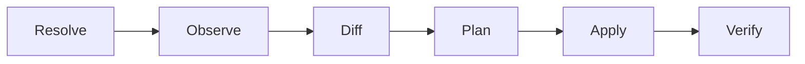

# Reconciliation

Reconciliation is one complete pass for one host, from resolving desired state
through observe, diff, plan, apply and verify. A pass is the unit of work Datum
performs and the unit it reports on, and it either completes or fails as a whole
even when only some of its actions ran.



Only one pass runs against a host at a time. Two concurrent passes would observe
the same state, build overlapping plans, and apply them against each other, so the
agent serialises them rather than attempting to reconcile the result.

## Convergence

A host is converged when its observed state satisfies its desired state for every
resource in the effective manifest.

Convergence is a property of a host at a moment, established by observation rather
than asserted by having applied something. A pass that applied fourteen changes
successfully and then failed to verify one of them did not converge the host, and
reporting otherwise would make the word useless.

## Pass outcomes

| Outcome | Meaning |
| ------- | ------- |
| `converged` | The plan was empty. Nothing was applied. |
| `changed` | Actions were applied and every affected resource verified. |
| `failed` | One or more actions failed, or verification did not confirm the intended state. |

A failed pass usually leaves the host partially changed, which is expected and
not a defect. Actions that succeeded before the failure are not undone.

## There is no rollback

Datum does not revert applied changes when a pass fails.

Reverting would require knowing the prior state well enough to restore it, and for
most resource types that is either impossible or a lie. Restoring a package to its
previous version assumes the old version is still available from a repository, and
restoring a file assumes its previous content was kept somewhere.

The state-based model gives a different answer. Correcting a bad change means
changing the repository and reconciling again, which is the same mechanism as any
other change and does not need a separate code path. This does mean the recovery
path for a bad commit is a new commit, and that reverting in Git is the operation
that matters.

!!! note "Security consideration"

    Because the agent is assumed to run as root, and because a bad commit
    propagates to every host its matchers match, the repository is the control
    plane and its access controls are the real ones. Review on the repository is
    not a process nicety. It is the mechanism that stops a single change from
    reaching a thousand machines.

## Failure containment

When an action fails, resources depending on it are skipped, never attempted.

```text
failed   File[nginx-config]     permission denied
skip     Service[nginx]         dependency File[nginx-config] failed
none     Package[nginx]         present, 1.24.0-2
```

Restarting nginx to load a configuration that failed to write has no useful
outcome, and attempting it converts a clear failure into a running service with
stale configuration. Resources with no dependency on the failed one are unaffected
and still reconcile, because a failure in one part of a manifest is not a reason to
abandon the rest of it.

## Retry

A failed pass is not retried within itself. The next pass observes the host again,
finds whatever drift remains, and produces a plan from current state.

Retrying by re-running the loop instead of retrying individual actions means
there is no partially-applied plan being resumed, and no question about whether
the state a retry assumed still holds. The cost is latency, since a transient
failure waits for the next pass rather than being retried immediately.

!!! note "Open question"

    How often a pass runs, whether the interval is configurable per host, and
    whether a failed pass should shorten the interval before the next one are all
    undecided. Continuous reconciliation implies an interval short enough that
    drift does not persist and long enough that a fleet does not overwhelm a Git
    remote, and nothing has been chosen.

## Ordering revisions

Two manifest digests can be compared for equality but not for which came first. Ordering
comes from the repository: the agent reads Git, so commit history says which revision
supersedes which.

There is no separate counter for this. A monotonic generation number would need an authority
to assign it, and nothing in the design is in a position to.
