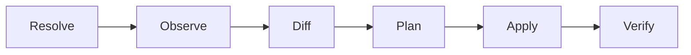

# Reconciliation

Reconciliation is one complete pass for one host, from resolving desired state
through observe, diff, plan, apply and verify. A pass is the unit of work Datum
performs and the unit it reports on, and it either completes or fails as a whole
even when only some of its actions ran.



## One pass at a time

Only one pass runs against a host at a time. Two concurrent passes would observe
the same state, build overlapping plans, and apply them against each other, so
every process that reconciles takes [an exclusive lock](../reconciliation/locking.md)
covering observation through verification.

## Convergence

A host is converged when every resource in its effective manifest has been
observed and its observed state satisfies its desired state.

Convergence requires observation, not a successful apply. A pass where every
provider reported success has not converged the host until the affected
resources have been read back and found to match, so convergence is established
by [verification](../resources/lifecycle.md#verify) rather than asserted by
having acted.

```text
apply exited zero        is not convergence
observed state matches   is convergence
```

That distinction is the core of Datum's approach. A `systemctl restart` that
returns zero while the service dies a second later has applied successfully and
has not converged, and only reading the unit's state afterwards tells the two
apart. A pass that applied fourteen changes and failed to verify one of them has
not converged the host.

## Pass outcomes

| Outcome | Meaning |
| ------- | ------- |
| `converged` | The plan was empty. Nothing was applied. |
| `changed` | Actions were applied and every affected resource verified. |
| `failed` | One or more actions failed, or verification did not confirm the intended state. |
| `drifted` | Drift was reported and not applied, either because the host is in [observe mode](reconciliation-modes.md) or because the difference is one no provider corrects. |

A failed pass usually leaves the host partially changed, which is expected and
not a defect. Actions that succeeded before the failure are not undone.

`drifted` exists because an observe-mode pass that found work to do fits none of
the other three. The pass neither converged the host nor failed, and reporting
the drift is the requested behaviour. Folding it into `converged` would let a
host with known drift report the same outcome as one with none.

An enforce-mode pass reports it for a second reason. A [uid that does not
match](../resources/types/user.md#identifiers) is drift Datum will not act on, so the pass neither
converged nor failed, and no number of further passes will change that. The distinction that matters
is whether an action was attempted, since drift left behind by an apply that claimed success is a
failure while drift nobody tried to correct is a report.

## There is no rollback

Datum does not revert applied changes when a pass fails.

Reverting would require knowing the prior state well enough to restore it, and for
most resource types that is either impossible or a lie. Restoring a package to its
previous version assumes the old version is still available from a repository, and
restoring a file assumes its previous content was kept somewhere.

The state-based model gives a different answer. Correcting a bad change means
changing the repository and reconciling again, which is the same mechanism as any
other change and does not need a separate code path. This does mean the recovery
path for a bad commit is a new commit, and that reverting in Git is the operation
that matters.

### Desired-state rollback is not system-state rollback

Two things get called rollback, and only one of them is cheap.

Desired-state rollback is reverting the repository to an earlier revision. Datum does this
readily, because it is an ordinary change like any other.

System-state rollback is undoing the effect of an applied change on the host, and
Datum does not do it, because many operations that reconciliation performs are not
reversible. Deleting a user, upgrading a database package that migrates its data on
disk, removing a package that ran a destructive uninstall script, and rotating a
credential all destroy state that reverting the repository cannot bring back.

```text
desired-state rollback     revert to an earlier revision      Datum can do this
system-state rollback      undo what the last revision did    the OS often cannot
```

Reverting to an earlier revision produces an earlier desired state, and
reconciliation then moves the host towards it using the same forward operations as
always. Whether that restores the previous condition depends entirely on whether the
individual changes were reversible, and for many they are not.

Datum therefore promises desired-state rollback and does not promise
transactional system rollback. Genuine system rollback needs mechanisms
underneath Datum, such as filesystem snapshots, OSTree, Nix generations or A/B
partitions, and a fleet that requires it builds on one of those instead of
expecting Datum to provide it.

!!! note "Security consideration"

    Because the agent is assumed to run as root, and because a bad commit
    propagates to every host its matchers match, the repository is the control
    plane and its access controls are the real ones. Review on the repository is
    not a process nicety. Review before merge is the control that bounds how far
    a single change spreads. See the [threat
    model](../security/threat-model.md).

## Failure containment

When an action fails, resources depending on it are skipped, never attempted.

```text
failed   File[nginx-config]     permission denied
skip     Service[nginx]         dependency File[nginx-config] failed
none     Package[nginx]         present, 1.24.0-2
```

Restarting nginx to load a configuration that failed to write has no useful
outcome, and attempting it converts a clear failure into a running service with
stale configuration. Resources with no dependency on the failed one are unaffected
and still reconcile, because a failure in one part of a manifest is not a reason to
abandon the rest of it.

## Retry

A failed pass is not retried within itself. The next pass observes the host again,
finds whatever drift remains, and produces a plan from current state.

Retrying by re-running the loop instead of retrying individual actions means
there is no partially-applied plan being resumed, and no question about whether
the state a retry assumed still holds. The cost is latency, since a transient
failure waits for the next pass rather than being retried immediately.

How often a pass runs, how a fleet avoids reconciling in lockstep, and what a failed
pass does to the timing of the next one are covered under
[scheduling](../reconciliation/scheduling.md) and
[failure handling](../reconciliation/failure-handling.md). The short answer is a
thirty-minute interval spread deterministically per host, with back-off on failures
that involve the Git remote and no change in timing for failures that do not.

## Ordering revisions

Two manifest digests can be compared for equality but not for which came first. Ordering comes from
the repository, because the agent reads Git and commit history says which revision supersedes which,
and the [accepted revision](../security/repository-trust.md#verifying-that-a-revision-is-current)
records how far a host has got.

There is no separate counter for this. A monotonic generation number would need an authority
to assign it, and nothing in the design is in a position to.
