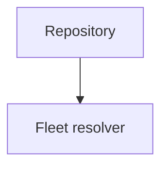

# Working on the documentation

The site is built with [Zensical](https://zensical.org/) and configured through
`zensical.toml`.

## Building and previewing

```bash
make docs-install    # create .venv and install the pinned toolchain
make docs-serve      # preview the site locally with live reload
make docs-build      # build into ./site
make docs-check      # build with --strict, which is what CI runs
```

The `Makefile` targets wrap the toolchain and add nothing to it. Running Zensical directly works the
same way.

```bash
python3 -m venv .venv
source .venv/bin/activate
pip install -r requirements-docs.txt
zensical serve
```

The version in `requirements-docs.txt` is pinned so that local builds and CI produce the same
output. Bumping it belongs in its own commit, after checking the rendered result.

## Strict mode

`zensical build --strict` fails on any warning, and link validation is enabled in
`zensical.toml`.

```toml
[project.validation]
invalid_links = true
invalid_link_anchors = true
unresolved_references = true
unresolved_footnotes = true
```

A link to a page that does not exist, or to a heading anchor that does not exist, fails the
build. This catches the most common way documentation rots, which is a heading being renamed
while links to it are left behind.

One thing strict mode does not catch is a page missing from the navigation. Zensical builds
pages that are not in `nav` and does not warn, so a new page can exist and be unreachable.
Adding a page means adding it to `nav` in the same change.

## Structure

Each top-level section is a directory under `docs/` with an `index.md` giving an overview and
linking to its pages. Navigation is explicit in `zensical.toml` rather than derived from the
filesystem, which keeps reading order under control.

| Section | Holds |
| ------- | ----- |
| `introduction/` | What Datum is, why it exists, how it works, current status |
| `concepts/` | Vocabulary, defined precisely and once |
| `fleet/` | How one repository produces per-host desired state |
| `resources/` | The resource model and the proposed types |
| `providers/` | The provider boundary and multi-distribution design |
| `architecture/` | Components, data flow, trust boundaries, deployment |
| `security/` | Trust model, attack vectors, handshakes and authenticity |
| `reference/` | Field and command lookup, glossary |
| `development/` | Contributing to the design, open questions |
| `adr/` | Architecture decision records |

One concept has one home. Where a term is used in several sections, the section that owns it
defines it and the others link to it, because a definition in two places becomes two
definitions.

## Writing conventions

Write as an engineer documenting a system for other engineers. State what something does,
what it costs, and where it breaks.

Say what is not decided. Where behaviour is unresolved, mark it instead of describing a guess as
though it were settled.

| Admonition | Used for |
| ---------- | -------- |
| `!!! note "Proposed behaviour"` | A concrete design that has not been accepted |
| `!!! note "Open question"` | A known gap with no decision yet |
| `!!! note "Planned"` | Accepted in principle, not specified |
| `!!! note "Security consideration"` | Something with a security consequence |
| `!!! note "Important limitation"` | Behaviour that will surprise somebody |
| `!!! note "Implementation status"` | A reminder that something does not exist |

Admonitions are for those cases. A page covered in coloured boxes is harder to read than one
with none, so ordinary explanation stays in prose.

Every new open question gets an entry in [open questions](open-questions.md), and resolving one
means removing the entry.

Keep examples consistent. The configuration examples across the site describe one fleet, with
`web-001` as the example host and nginx as the example service. Changing the proposed syntax means
updating every example rather than leaving two syntaxes in circulation.

Avoid marketing language, and avoid asserting that something works when nothing is
implemented.

## Diagrams

Mermaid is available through the fenced block configuration in `zensical.toml`.

````text

````

A diagram should communicate a relationship or a sequence that prose handles badly. Diagrams that
restate the surrounding paragraph should be deleted, and every diagram needs enough prose around it
that the page still makes sense without it.

Plain text diagrams in fenced blocks are often clearer than Mermaid for short pipelines, and
they diff readably.

Mermaid is rendered in the browser, not at build time, so a syntax error produces a diagram that
silently fails to draw and a build that reports nothing. `make docs-mermaid` parses every block with
the real parser and is part of `make docs-check`.

The common mistake is a node identifier that is also a keyword. A `graph TD` diagram cannot
have a node called `graph`, so name it `rgraph` or similar.

## Before committing

Run `make docs-check`, which builds with `--strict` and parses every diagram. Read the rendered page
and not only the source, because tables and admonitions are easy to get subtly wrong in Markdown and
obvious in the browser.

Keep commits small and coherent, one improvement each, with a one-line [Conventional
Commits](https://www.conventionalcommits.org/) subject.

```text
docs(fleet): describe host labels and matchers
docs(adr): record typed resource decision
fix(docs): correct matcher precedence example
refactor(docs): simplify fleet terminology
```

The repository should build at every commit, so a change that adds a page adds its navigation
entry and any links to it in the same commit.
