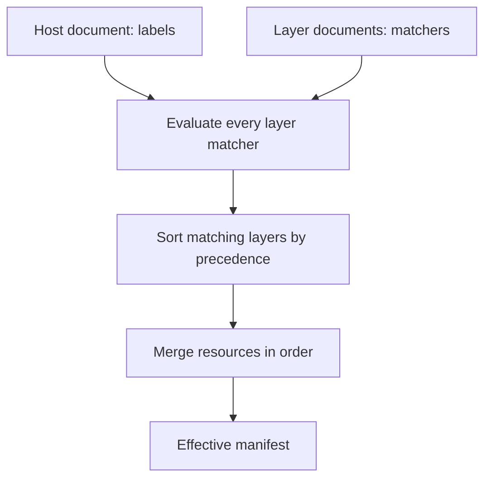

# Fleet

A fleet is the set of hosts one repository describes, from a single machine to several
thousand. The mechanism does not change with size.

Hosts are mostly similar and never identical. Twenty web servers share a package list and
a service configuration, differ by site in their resolver settings, differ by environment
in their kernel tuning, and one of them has a memory limit somebody raised during an
incident two years ago. Writing twenty files puts the shared parts in twenty places.

## How configuration reaches a host



The host's labels come from its `Host` document, every `Layer` matcher is evaluated against them,
and the matching layers are sorted by precedence and merged in that order with higher precedence
winning. The result is the effective manifest.

Nothing in that sequence reads the machine. Resolution is a function of repository content
and a host name, so a manifest can be produced for any host from a checkout and compared
between revisions.

## The parts of the model

[Repository layout](repository-layout.md)
:   The four document types, how resources attach to layers, and why directory names carry
    no meaning.

[Labels and matchers](labels-and-matchers.md)
:   How hosts are classified, what a matcher can express, and where labels come from.

[Composition](composition.md)
:   How matching layers are merged into one set of resources, field by field.

[Precedence and conflicts](precedence.md)
:   Which layer wins, why equal-precedence disagreements are errors, and how provenance is
    preserved.

[Effective manifests](effective-manifests.md)
:   The artefact composition produces, and its content address.

## The question the model has to answer

```text
Why does this resource apply to this host?
```

Composition is lossy, since its purpose is to turn many documents into one answer. Without a
requirement to explain the result, a resolver would merge fields, discard where they came from, and
leave an engineer to reconstruct the merge by hand.

Two constraints follow. Every field in a manifest retains the layer that set its final
value and the values it displaced. Every matching layer retains the labels that caused it
to match. Neither may be dropped as an optimisation.

!!! note "Proposed design"

    The fleet model is proposed, not accepted. The reasoning is in
    [ADR-0004](../adr/0004-labels-and-matchers.md). Labels and matchers are the intended
    mechanism and the merge and precedence rules are specified. None of it has been tested
    against a repository of real size, which is where composition models usually turn out
    to be too rigid or too clever.
