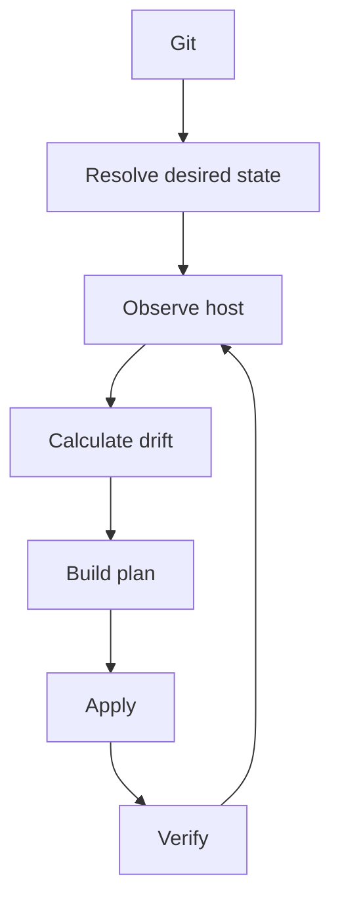

# Datum

Datum continuously reconciles Linux systems against their desired state in Git.

A machine is described as a set of resources covering the packages installed on
it, the contents and permissions of its configuration files, the services that
run at boot, the users and groups that exist, and the values of kernel
parameters. Datum's job on each pass is to resolve the resources that apply to
the machine, read the machine to establish what is currently true, and change
only what differs.

The pass repeats rather than running once, because configuration drifts.
Upgrades replace files, people edit them under pressure, and a machine that was
correct last month is not necessarily correct today. Running the same pass again
finds the difference and corrects it.

One repository can describe a single machine or several thousand of them,
running more than one Linux distribution.

!!! warning "Datum is in the design phase"

    Nothing on this site is implemented. The documentation is the
    specification: it records the intended architecture and behaviour so that
    implementation has something concrete to build against. Configuration
    formats and command names will change before the first release.

## The reconciliation cycle

Every pass starts by reading the host, because there is no assumption that the
previous pass completed or that nothing else has changed the machine since.



Desired state is resolved from the repository at a known revision, and observed
state is read from the host at the start of the pass. The difference between
them is the plan: the set of changes that would bring the machine to the state
the repository asks for, ordered according to the dependencies declared between
resources. Applying that plan and re-reading the resources it touched completes
the pass.

```text
desired state + observed state -> plan -> reconciliation
```

Where a machine already matches the repository the plan is empty and nothing is
applied, which is what most passes over a settled fleet are expected to look
like.

## Reading this site

The documentation is the specification for Datum, so it reads as much like a
design document as a user guide. Start with the
[introduction](introduction/index.md), which covers what Datum manages and how
one repository maps onto many machines. The sections after it work through the
model in the order it is easiest to learn: the
[vocabulary](concepts/index.md), then the [fleet layout](fleet/index.md), then
[resources](resources/index.md) and [providers](providers/index.md), then the
[architecture](architecture/index.md) that connects them, then the
[security model](security/index.md).

[Reference](reference/index.md) holds the field and command lookups, and
[decisions](adr/index.md) records what has been settled and why. Everything still
unresolved is listed in [open
questions](development/open-questions.md).
