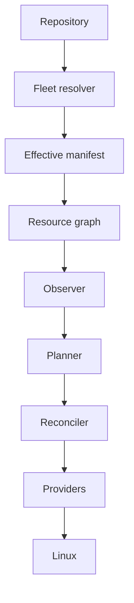

# How Datum works

This page follows one change from a Git commit through to a verified result on a single host. The
components it names are specified in [architecture](../architecture/components.md), and the
configuration it shows is proposed, not settled, but the sequence is the part being committed to.



## The repository

Three resources describe nginx on a web server. They live together in a layer
that selects hosts labelled `role: web`.

```yaml title="fleet/roles/web/layer.yaml"
datum: v1alpha1
type: Layer

name: web

precedence: 30
match:
  labels:
    role: web
```

```yaml title="fleet/roles/web/nginx.yaml"
datum: v1alpha1
type: Package

name: nginx

desired:
  state: present
---
datum: v1alpha1
type: File

name: nginx-config

requires:
  - Package[nginx]

desired:
  path: /etc/nginx/nginx.conf
  owner: root
  group: root
  mode: "0640"
  source: files/nginx.conf
---
datum: v1alpha1
type: Service

name: nginx

requires:
  - Package[nginx]
  - File[nginx-config]

restartOn:
  - File[nginx-config]

desired:
  state: running
  enabled: true
```

Nothing here names a distribution or a package manager, and nothing states an
order of operations. The `requires` fields express which resources have to be
settled before which, and the planner derives the order from them.

One host in this fleet needs a stricter mode on that file than the role gives it, which
is expressed as a layer selecting that host alone.

```yaml title="fleet/hosts/web-001/layer.yaml"
datum: v1alpha1
type: Layer

name: host-web-001

precedence: 100
match:
  labels:
    datum/host: web-001
```

```yaml title="fleet/hosts/web-001/nginx-tuning.yaml"
datum: v1alpha1
type: File

name: nginx-config

desired:
  mode: "0600"
```

The second document contributes one field. It does not repeat the path, the owner or the
source, because those come from the role layer and only the mode is being changed.

## Resolving desired state

Reconciliation starts from a repository revision, because a pass that cannot name
the commit it acted on cannot be reproduced or audited afterwards.

The fleet resolver reads the `Host` document for `web-001`, collects every layer whose matcher
matches its labels, and merges them in precedence order. The role layer at precedence 30 is folded
before the host layer at 100, so the mode ends up as `0600` and everything else on the file comes
from the role. The result is the effective manifest, the complete set of resources for that host
with the provenance of each one recorded.

```text
host       web-001
revision   8b91f20
manifest   sha256:3f2a9c4e
resources  14
```

The manifest is content-addressed, because that gives a single value identifying
exactly what was reconciled. Two hosts with the same digest received the same
instructions, and a host reporting a digest that was never issued to it is
running something it was not sent.

## Observing the host

The observer reads the current state of each of the fourteen resources. For this
example that means asking the package provider whether `nginx` is installed and
at what version, reading the metadata and content of `/etc/nginx/nginx.conf`, and
asking systemd whether the `nginx` unit is active and enabled.

Observation is read-only. That is a hard rule and not a convention, because an
observer that changes the host removes any possibility of a plan that can be
trusted before it is applied.

## Diffing and planning

Diffing compares the two states field by field. In this pass the package is
already installed, the file content differs from what the repository holds, and
the mode on disk is `0644` where the resolved manifest asks for `0600`.

The planner turns those differences into actions and orders them using the
resource graph. `Package[nginx]` has no work to do but still sorts before
`File[nginx-config]`, which sorts before `Service[nginx]`. Because the file is
changing and the service declares `restartOn` for it, the service is scheduled
for a restart even though its own desired state of running and enabled is already
satisfied.

```text
host       web-001
revision   8b91f20
manifest   sha256:3f2a9c4e

update   File[nginx-config]
         path     /etc/nginx/nginx.conf
         mode     0644 -> 0600
         content  differs
         from     roles/web, hosts/web-001

update   Service[nginx]
         reason   File[nginx-config] changed, restartOn matched
         from     roles/web (matched role=web)

none     Package[nginx]      present, 1.24.0-2
none     User[www-data]      present

0 to create, 2 to update, 0 to remove, 0 to skip, 12 unchanged
```

!!! note "Proposed output format"

    The rendering above is illustrative and the exact layout is not settled. A
    plan always contains every resource, the action chosen for it, the fields
    that differ, and where the resource came from.

A plan is an artefact in its own right, and building one does not commit to
applying it. That is what allows the same code path to serve both a preview and
a real run, rather than the preview being a separate approximation that drifts
away from the thing it is meant to predict.

## Applying

The reconciler walks the plan in order and hands each action to the provider for
that resource type. Writing the file is the `File` provider's work and
restarting the unit is the `systemd` provider's work. Neither provider evaluates
whether the action was necessary.

Failure is contained. If writing `/etc/nginx/nginx.conf` fails, the service
restart that depends on it is not attempted, because restarting nginx to load a
configuration that failed to write has no useful outcome. Resources with no
dependency on the failed one are unaffected and still reconcile.

## Verifying

After applying, the reconciler reads the affected resources again through the
same observation path used at the start of the pass. The file is re-read and
compared, and the unit is checked for being active and enabled.

Verification is what turns "the action ran" into "the state is correct", and the
difference matters more often than it sounds. A `systemctl restart` can return
successfully while the unit fails moments later, and a file write can succeed
while the mode is left wrong by an unexpected umask.

## The next pass

On the following pass the file matches, the mode matches, the unit is active and
enabled, and the plan comes out empty. Nothing is applied and nothing is
restarted, which is the behaviour idempotence gives.

If someone edits `/etc/nginx/nginx.conf` on the host in the meantime, the next
pass produces the same two-action plan again. Datum does not need to know that a
human made the change, or when, because the comparison is against the
repository, not against a record of what Datum did last time.
